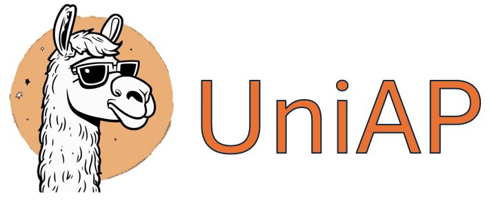

# UniAP: Towards Universal Animal Perception in Vision via Few-shot Learning

[](https://arxiv.org/abs/2308.09953)

> **UniAP: Towards Universal Animal Perception in Vision via Few-shot Learning**  
> Meiqi Sun*, Zhonghan Zhao*, Wenhao Chai*, Hanjun Luo, Shidong Cao, Yanting Zhang, Jenq-Neng Hwang, Gaoang Wang   
> _AAAI 2024_  

We introduce UniAP, a novel Universal Animal Perception model that leverages few-shot learning to enable cross-species perception among various visual tasks.

## :fire: News
* **[2023.12.10]**: 🎉 Our paper is accepted by AAAI 2024.
* **[2023.08.20]** : We release our code.
* **[2023.08.19]** :page_with_curl: We release the [paper](https://arxiv.org/abs/https://arxiv.org/abs/2308.09953).

<h3 align="center"> If you like our project, please give us a star ⭐ on GitHub for the latest update.</h3>

## Setup
1. Download Datasets
  * Animal Kingdom Dataset (pose estimation) from the official GitHub page https://github.com/sutdcv/Animal-Kingdom/blob/master/Animal_Kingdom/pose_estimation/README_pose_estimation.md.
  * Animal Pose Dataset from the official GitHub page https://github.com/noahcao/animal-pose-dataset.
  * APT-36K Dataset from the official GitHub page https://github.com/pandorgan/APT-36K.
  * Oxford-IIIT Pet Dataset from the official page https://www.robots.ox.ac.uk/~vgg/pets/.
  * (Optional) Resize the images and labels into (256, 256) resolution.
  * We stored data from all animal images and labels in a single directory. The directory structure looks like:
  ```
  <Root>
  |--<AnimalKingdom>
  |   |--<animal1>_<rgb>
  |   | ...
  |   |--<animal2>_<label>
  |   |...
  |
  |--<APT-36K>
  |   |--<animal1>_<rgb>
  |   | ...
  |   |--<animal2>_<label>
  |   |...
  |
  |--<AnimalPose>
  |   |--<animal1>_<rgb>
  |   | ...
  |   |--<animal2>_<label>
  |   |...
  |
  |--<Oxford-IIITPet>
  |   |--<animal1>_<rgb>
  |   | ...
  |   |--<animal2>_<label>
  |   |...
  |
  |...
  ```

1. Create `data_paths.yaml` file and write the root directory path (`<Root>` in the above structure) by `UniASET: PATH_TO_YOUR_UniASET`.

2. Install pre-requirements by `pip install -r requirements.txt`.

3. Create `model/pretrained_checkpoints` directory and download [BEiT pre-trained checkpoints](https://github.com/microsoft/unilm/tree/master/beit) to the directory.
  * We used `beit_base_patch16_224_pt22k` checkpoint for our experiment.
  * We also provided the pre-trained model trained on the AnimalKingdom dataset that can be used to run the configs/demo.yaml (https://drive.google.com/file/d/1HmSMn1h4rY5JtEjS7Th8iPTJhFbAnW9x/view?usp=sharing)

## Usage

### Training
```
python main.py --stage 0 --task_id [0/1/2/3]
```
  * If you want to train universally on all tasks, please set `task_id=3`. 
  * If you want to train on the specific task, please follow `task_id=0`: pose estimation, `task_id=1`: semantic segmentation, `task_id=2`: classification.
### Fine-tuning

```
python main.py --stage 1 --task [kp/mask/cls]
```
* If you want to finetune on the specific task, please follow `task=kp`: pose estimation, `task=mask`: semantic segmentation, `task=cls`: classification.
### Evaluation

```
python main.py --stage 2 --task [kp/mask/cls]
```
* If you want to evaluate on the specific task, please follow `task=kp`: pose estimation, `task=mask`: semantic segmentation, `task=cls`: classification.

## Acknowledgements
Our code refers the following repositores:
* [BEiT: BERT Pre-Training of Image Transformers](https://github.com/microsoft/unilm/tree/master/beit)
* [Pose for Everything: Towards Category-Agnostic Pose Estimation](https://github.com/luminxu/Pose-for-Everything)
* [Images Speak in Images: A Generalist Painter for In-Context Visual Learning](https://github.com/baaivision/Painter)
* [Segment Anything](https://github.com/facebookresearch/segment-anything)
* [Contrastive Language-Image Pre-Training](https://github.com/openai/CLIP)

## Citation

If you find STEVE useful for your your research and applications, please cite using this BibTeX:

```bibtex
@article{sun2023uniap,
  title={UniAP: Towards Universal Animal Perception in Vision via Few-shot Learning},
  author={Sun, Meiqi and Zhao, Zhonghan and Chai, Wenhao and Luo, Hanjun and Cao, Shidong and Zhang, Yanting and Hwang, Jenq-Neng and Wang, Gaoang},
  journal={arXiv preprint arXiv:2308.09953},
  year={2023}
}
```
